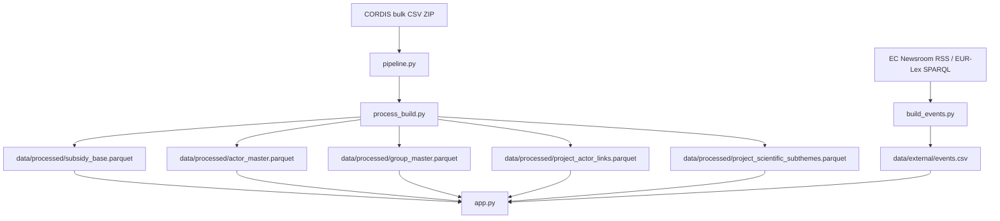

# Subsidy Intelligence Radar — documentation technique complète

Version de référence : code courant du repository.
Langue : FR technique.

## 1. Objet du système

Le projet fournit une application Streamlit d'analyse de projets CORDIS, construite sur un pipeline de préparation de données qui :
- télécharge et normalise les bulk CSV CORDIS (`Horizon Europe` + `Horizon 2020`) ;
- produit un dataset analytique stable ;
- dérive des tables de support pour les vues acteurs, groupes, partenariats et sous-thèmes scientifiques ;
- expose ces artefacts dans une interface orientée métier.

Le produit vise trois usages principaux :
- exploration rapide par question métier ;
- analyse structurée par domaines CORDIS, thèmes principaux et pays ;
- lecture experte via vues détaillées, exports et diagnostics.

## 2. Évolution du modèle produit

Le produit n'est plus structuré autour d'une taxonomie métier OneTech comme axe principal.

Le modèle actuel sépare explicitement :

1. `cordis_domain_ui`
   - domaine de navigation UX parmi 11 grands domaines CORDIS.
2. `cordis_theme_primary`
   - thème principal officiel unique, utilisé pour le comptage principal par projet.
3. `scientific_subthemes`
   - sous-thèmes scientifiques multi-label, utilisés pour l'exploration fine.
4. les champs CORDIS bruts (`topic`, `topics`, `call`, `frameworkProgramme`, etc.)
   - conservés pour l'explicabilité, les exports et les usages experts.

Conséquences :
- un projet conserve un seul thème principal officiel ;
- un projet peut porter plusieurs sous-thèmes scientifiques ;
- les totaux globaux restent calculés sur le dataset principal, jamais en sommant l'explosion des sous-thèmes.

## 3. Vue d'ensemble d'architecture



Principes :
- l'app lit principalement des artefacts locaux versionnés ou reconstruits hors runtime lourd ;
- DuckDB sert de couche d'accès et de compatibilité sur `subsidy_base.parquet` ;
- le pipeline et le build restent séparés de l'interface ;
- le mode cloud s'appuie sur des artefacts déjà présents, pas sur un rebuild lourd au chargement.

## 4. Fichiers structurants du repository

### 4.1 Application

- `app.py`
  - interface Streamlit, navigation, filtres, analytics DuckDB, exports.
- `cordis_labels.py`
  - humanisation des libellés visibles par l'utilisateur (`cordis_domain_ui`, `cordis_theme_primary`, sous-thèmes).

### 4.2 Build / pipeline

- `pipeline.py`
  - orchestration incrémentale locale ;
  - logique de lock ;
  - vérification de schéma ;
  - déclenchement du build principal.
- `process_build.py`
  - construction du dataset principal et des tables dérivées.
- `cordis_taxonomy.py`
  - règles CORDIS-first de dérivation du thème principal, domaine UI et sous-thèmes scientifiques.
- `theme_classifier_v3.py`
  - enrichissement déterministe des sous-thèmes scientifiques multi-label.
- `build_events.py`
  - construction de la couche macro/événements.
- `incremental_connectors.py`
  - connecteurs incrémentaux optionnels pour sources externes supplémentaires.

### 4.3 Données

- `data/raw/`
  - données brutes locales (non destinées au runtime cloud direct).
- `data/processed/`
  - datasets analytiques et tables dérivées.
- `data/external/`
  - événements, mapping groupes, manifest connecteurs.

## 5. Sources et artefacts

### 5.1 Sources principales actives

1. CORDIS bulk CSV ZIP
   - `cordis-HORIZONprojects-csv.zip`
   - `cordis-h2020projects-csv.zip`
2. EC Newsroom RSS
3. EUR-Lex / Cellar SPARQL

### 5.2 Sources optionnelles

Via `data/external/connectors_manifest.csv` :
- connecteurs API JSON / CSV ;
- connecteurs MCP ;
- enrichissements externes incrémentaux.

L'application n'appelle pas ces APIs en continu pendant la navigation. Le modèle retenu reste :
- refresh hors affichage principal ;
- écriture en fichiers d'artefacts ;
- lecture rapide ensuite par l'app.

## 6. Dataset principal : `subsidy_base`

### 6.1 Grain de la table

Le dataset principal est au grain participant/projet.

Conséquence importante :
- un projet peut apparaître sur plusieurs lignes s'il porte plusieurs acteurs ;
- les compteurs projet doivent donc utiliser `COUNT(DISTINCT projectID)` ;
- les budgets lus dans un périmètre filtré correspondent au périmètre courant du dataset, pas nécessairement à une enveloppe projet abstraite détachée de tout filtre acteur/pays.

### 6.2 Colonnes structurantes actuelles

Colonnes fonctionnelles majeures :
- `source`
- `program`
- `section`
- `year`
- `projectID`
- `acronym`
- `title`
- `objective`
- `abstract`
- `actor_id`
- `pic`
- `org_name`
- `entity_type`
- `country_alpha2`
- `country_alpha3`
- `country_name`
- `amount_eur`
- `value_chain_stage`
- `project_status`
- `cordis_domain_ui`
- `cordis_theme_primary`
- `cordis_theme_primary_source`
- `cordis_topic_primary`
- `cordis_topics_all`
- `cordis_call`
- `cordis_framework_programme`
- `scientific_subthemes`
- `scientific_subthemes_count`
- `legacy_theme`
- `legacy_sub_theme`
- `theme`
- `sub_theme`

### 6.3 Champs de compatibilité

Le repo garde encore des champs de compatibilité :
- `theme`
  - recopié à partir de `cordis_theme_primary` dans la couche analytique ;
- `sub_theme`
  - compatibilité courte issue du premier sous-thème scientifique disponible ;
- `legacy_theme`
  - ancienne valeur avant bascule CORDIS-first ;
- `legacy_sub_theme`
  - ancienne valeur de sous-thème.

But :
- éviter de casser les vues existantes ;
- permettre une migration progressive ;
- ne plus utiliser ces champs comme axe produit principal.

## 7. Tables analytiques dérivées

`process_build.py` écrit en complément :

- `actor_master.{csv,parquet}`
  - synthèse par acteur.
- `group_master.{csv,parquet}`
  - synthèse par groupe si mapping disponible.
- `project_actor_links.{csv,parquet}`
  - table détaillée projet x acteur/groupe.
- `project_scientific_subthemes.{csv,parquet}`
  - explosion projet x sous-thème scientifique.

### 7.1 Table `project_scientific_subthemes`

Colonnes attendues :
- `projectID`
- `cordis_domain_ui`
- `cordis_theme_primary`
- `subtheme_level_1`
- `subtheme_level_2`
- `subtheme_level_3`
- `subtheme_label`
- `subtheme_path`
- `source_method`

Cette table sert à :
- filtrer finement sur les sous-thèmes ;
- alimenter les vues d'exploration fine ;
- conserver l'explicabilité de la structure hiérarchique.

Elle ne doit pas servir à recalculer les totaux globaux projet/budget par simple somme des lignes explosées.

## 8. Logique de classification CORDIS-first

### 8.1 Thème principal officiel

La fonction `derive_cordis_theme_primary()` applique une cascade déterministe :

1. `programmeDivisionTitle`
2. `programmeDivision`
3. `topic`
4. `call`
5. `frameworkProgramme`
6. fallback explicite

Le résultat est stocké dans :
- `cordis_theme_primary`
- `cordis_theme_primary_source`

Objectif :
- privilégier le label officiel le plus précis déjà disponible dans les métadonnées ;
- éviter de réinventer un thème si CORDIS fournit déjà un champ structurant.

### 8.2 Domaine UX CORDIS

`cordis_domain_ui` est dérivé par règles traçables à partir de :
- `cordis_theme_primary`
- `topic` / `topics`
- `call`
- `frameworkProgramme`
- et, en dernier recours, du texte projet si besoin.

Le niveau `cordis_domain_ui` sert à :
- la home page guidée ;
- les filtres simples ;
- les lectures synthétiques et macro.

### 8.3 Sous-thèmes scientifiques multi-label

`theme_classifier_v3.py` ne décide plus du thème principal produit.

Son rôle actuel est :
- déduire des sous-thèmes scientifiques multi-label au niveau projet ;
- sérialiser la liste dans `scientific_subthemes` ;
- produire une vue courte de compatibilité via `sub_theme` ;
- produire la table `project_scientific_subthemes`.

Le module s'appuie sur `cordis_taxonomy.py` :
- `infer_scientific_subtheme_records()`
- `scientific_subtheme_labels()`
- `first_scientific_subtheme()`

Format principal :
- `scientific_subthemes` = liste JSON sérialisée ;
- `scientific_subthemes_count` = nombre de labels ;
- `project_scientific_subthemes` = table annexe normalisée.

## 9. Pipeline et refresh

### 9.1 `pipeline.py`

Rôle :
- vérifier si un rebuild est nécessaire ;
- comparer les stamps des sources ;
- vérifier la présence du schéma attendu ;
- acquérir et relâcher un lock ;
- déclencher `process_build.py` si besoin.

Logique locale :
- si le parquet manque, si le CSV manque, si le schéma manque, si les sources ont changé ou si `force=True`, alors rebuild.

Logique cloud :
- pas de gros téléchargement CORDIS ;
- si le parquet existe déjà, on le lit ;
- sinon l'app doit être alimentée par un rebuild local/pipeline et un commit des artefacts.

### 9.2 `process_build.py`

Rôle :
- charger les bulk CORDIS ;
- normaliser les colonnes ;
- calculer le statut projet et la chaîne de valeur ;
- construire le niveau projet CORDIS-first ;
- enrichir les sous-thèmes scientifiques ;
- rebroadcast au grain principal ;
- écrire CSV, parquet et tables dérivées de manière atomique.

Étapes majeures :
1. chargement des programmes CORDIS ;
2. fusion et enforcement du schéma ;
3. conservation des champs legacy ;
4. dérivation du niveau projet (`cordis_theme_primary`, `cordis_domain_ui`, etc.) ;
5. enrichissement multi-label scientifique ;
6. réinjection des colonnes projet dans le dataset principal ;
7. écriture des artefacts.

### 9.3 `build_events.py`

Rôle :
- construire `data/external/events.csv` à partir des sources RSS et SPARQL ;
- alimenter la lecture macro dans l'app ;
- conserver une logique append/refresh contrôlée.

## 10. Application Streamlit

## 10.1 Principes UX

L'application est conçue pour rester lisible par un utilisateur métier non technique.

La hiérarchie d'affichage visible est désormais :
1. `Domaines CORDIS`
2. `Thème principal CORDIS`
3. `Sous-thèmes scientifiques`
4. codes CORDIS bruts en second niveau seulement (détails, tooltips, exports)

`cordis_labels.py` centralise l'humanisation des libellés affichés.

## 10.2 Entrée guidée

La home page guidée repose sur :
- une intention de lecture ;
- des domaines CORDIS ;
- une recherche libre ;
- un choix de pays ;
- une période.

Elle applique ensuite ce cadrage à l'analyse complète.

## 10.3 Deux modes d'usage

### Vue d'ensemble

Mode simplifié orienté lecture rapide. Onglets principaux :
- `⌕ Recherche & résultats`
- `◎ Géographie`
- `↗ Tendances & événements`

### Recherche avancée

Mode complet avec filtres et vues expertes supplémentaires :
- `⌕ Recherche & résultats`
- `◈ Acteurs`
- `◎ Géographie`
- `↗ Tendances & événements`
- `◇ Outils experts`
- `⋯ Données, méthode & exports`

## 10.4 Filtres principaux

Filtres visibles par défaut :
- période ;
- domaines CORDIS ;
- thème principal CORDIS ;
- pays ;
- recherche libre.

Filtres avancés :
- programme ;
- source ;
- type d'entité ;
- statut projet ;
- sous-thèmes scientifiques ;
- options d'analyse (`OneTech`, regroupement d'acteurs, exclusion financeurs).

## 10.5 Vues et usages

### Recherche & résultats

- porte d'entrée principale ;
- table projet lisible ;
- détail projet ;
- quick actions vers acteurs, géographie et tendances.

### Acteurs

- classement et profil acteur ;
- drilldowns depuis les résultats.

### Géographie

- distribution des financements par pays ;
- quick actions pour filtrer ensuite les résultats ou les tendances sur un pays.

### Tendances & événements

- lecture temporelle par défaut sur `cordis_domain_ui` ;
- comparaison de périodes ;
- couche macro d'événements.

### Outils experts

- comparaison d'acteurs ;
- étapes et acteurs ;
- partenariats ;
- concentration.

### Données, méthode & exports

- exports ;
- informations de méthode ;
- qualité ;
- diagnostics.

## 10.6 Humanisation des labels

L'app ne doit pas exposer un code CORDIS brut comme lecture principale d'un graphe synthétique si un label plus lisible existe.

`cordis_labels.py` gère notamment :
- `domain_raw_to_display()`
- `theme_raw_to_display()`
- `scientific_subthemes_compact()`
- `format_dimension_value()`
- `build_dimension_hover_html()`

Usage :
- `cordis_domain_ui` comme défaut dans les vues synthétiques ;
- `cordis_theme_primary` humanisé quand il est affiché ;
- valeur brute conservée dans le tooltip ou le détail.

## 11. Couche DuckDB et compatibilité

L'app n'interroge pas directement le parquet brut tel quel partout.

Elle construit une vue DuckDB `subsidy_base` qui :
- applique les colonnes de compatibilité ;
- reconstruit les champs dérivés si besoin ;
- filtre certains périmètres non souhaités ;
- expose une structure stable au reste de l'application.

Une seconde vue `project_scientific_subthemes_view` alimente les filtres et lectures multi-label sur les sous-thèmes.

## 12. Règles de comptage et d'interprétation

Règles à respecter :

1. total projets = `COUNT(DISTINCT projectID)` ;
2. le thème principal CORDIS reste unique par projet ;
3. les sous-thèmes scientifiques peuvent montrer plusieurs lignes pour un même projet ;
4. on ne somme jamais l'explosion des sous-thèmes pour reconstituer le total global ;
5. les budgets lus dans l'app doivent toujours être interprétés dans le périmètre filtré courant.

En pratique :
- une vue résultats, géographie ou acteurs travaille sur le dataset principal filtré ;
- une vue sous-thèmes peut utiliser la table projet x sous-thème, mais à titre exploratoire uniquement.

## 13. Mapping groupes et financeurs

Le repo prend en charge un mapping groupes acteurs via :
- `data/external/actor_groups.csv`
- fallback `actor_groups.template.csv`

Effets :
- regroupement par groupe / PIC ;
- consolidation d'acteurs ;
- exclusion facultative de financeurs/agences.

Le mapping reste partiel si le CSV ne couvre pas tous les identifiants réels présents dans les données.

## 14. Déploiement et automatisation

### Local

Usage recommandé :
- `python pipeline.py` pour un refresh incrémental ;
- `python process_build.py` pour un rebuild complet ;
- `python build_events.py` pour la couche événements.

### Streamlit Community Cloud

Le bouton de refresh lourd est volontairement désactivé côté cloud.

Stratégie recommandée :
- lancer les rebuilds en local ou via GitHub Actions ;
- versionner / pousser les artefacts utiles ;
- laisser l'app cloud lire les artefacts déjà produits.

## 15. Compatibilité et migration

Le dépôt est dans une logique de migration maîtrisée :
- maintien de champs legacy ;
- maintien de certaines vues qui lisent encore `theme` ou `sub_theme` ;
- réorientation progressive de l'UX vers `cordis_domain_ui`, `cordis_theme_primary` et `scientific_subthemes` (une seule valeur maximum).

Ce qu'il ne faut plus faire :
- considérer `theme` legacy comme le cœur produit ;
- présenter `OneTech` comme axe principal ;
- sommer des sous-thèmes pour reconstruire le total.

## 16. Limites connues

- le dataset principal reste au grain participant/projet, ce qui demande de la rigueur dans l'interprétation des budgets ;
- le mapping groupes dépend de la qualité de `actor_groups.csv` ;
- la couche événements reste un contexte de lecture, pas une vérité causale ;
- la qualité des sous-thèmes scientifiques peut encore nécessiter du tuning métier si l'on veut un niveau d'exigence plus fin par domaine.

## 17. Commandes utiles

### Compiler les fichiers principaux

```bash
python3 -m py_compile app.py process_build.py pipeline.py theme_classifier_v3.py cordis_taxonomy.py cordis_labels.py
```

### Rebuild incrémental

```bash
python pipeline.py
```

### Rebuild complet

```bash
python process_build.py
```

### Lancer l'app

```bash
streamlit run app.py
```

## 18. Documents associés

- `README.md`
- `AUDIT_QUALITE_CORDIS_RADAR_2026-03-19.md`
- `AUDIT_EXECUTIVE_SUMMARY_CORDIS_RADAR_2026-03-19.md`
- `AUDIT_TECHNIQUE_RISQUES_PREUVES_2026-03-19.md`

