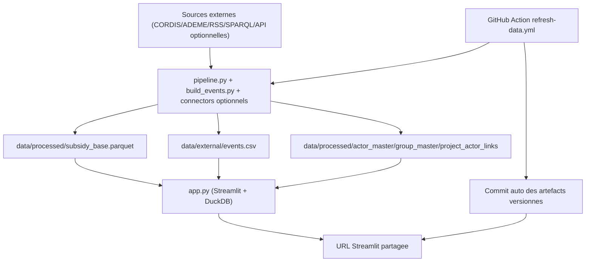
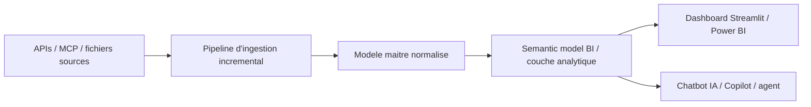

# Subsidy Intelligence Radar - Documentation technique complete

Version cible: code courant du repo.
Langue: FR (technique), sans simplification.

## 1) Objectif du systeme

Le projet fournit une application Streamlit interne pour analyser des projets finances (principalement CORDIS Horizon Europe / H2020), avec:
- exploration interactive (filtres, KPI, benchmark, geo, tendances),
- couche "Macro & news" basee sur un fichier d'evenements,
- mecanisme de refresh des donnees,
- automatisation durable via GitHub Actions.

Le systeme est pense pour:
- fonctionner localement,
- etre deployee sur Streamlit Community Cloud,
- rester maintenable (pipeline separe, formats de donnees stables, artefacts intermediaires explicites).

## 2) Vue d'ensemble architecture



Points importants:
- Le coeur analytics lit surtout `subsidy_base.parquet`.
- `events.csv` alimente l'onglet Macro.
- Les tables master acteur/groupe servent aux analyses avancees et au regroupement.
- L'automatisation durable en Cloud passe par GitHub Actions (pas uniquement par le bouton Refresh de l'UI).

## 3) Arborescence utile

- `app.py`: application Streamlit complete.
- `pipeline.py`: orchestration des mises a jour de donnees principales (incremental + lock + state).
- `process_build.py`: construction/normalisation du dataset principal et tables master.
- `build_events.py`: generation du fichier `events.csv` (RSS + SPARQL).
- `incremental_connectors.py`: framework de connecteurs API/MCP incrementaux (optionnel).
- `.github/workflows/refresh-data.yml`: automatisation GitHub quotidienne/manuelle.
- `data/processed/`: artefacts analytiques.
- `data/external/`: evenements, mapping groupes, manifests connecteurs.

## 4) APIs et sources utilisees

## 4.1 Sources coeur (actives)

1. CORDIS bulk ZIP (CSV):
- `https://cordis.europa.eu/data/cordis-HORIZONprojects-csv.zip`
- `https://cordis.europa.eu/data/cordis-h2020projects-csv.zip`

2. ADEME via API data.gouv.fr (meta dataset + ressource CSV):
- `https://www.data.gouv.fr/api/1/datasets/640afdff7a07961cdc232d19/`

3. EC Newsroom RSS:
- `https://ec.europa.eu/newsroom/horizon2020/feed?lang=en&orderby=item_date&topic_id=615`
- `https://ec.europa.eu/newsroom/horizon2020/feed?lang=en&orderby=item_date&topic_id=613`

4. EUR-Lex / Cellar SPARQL:
- `https://publications.europa.eu/webapi/rdf/sparql`

## 4.2 Sources optionnelles (framework pret, configuration locale requise)

Via `data/external/connectors_manifest.csv`:
- CINEA API (placeholder),
- Qlik API (placeholder),
- EU Funding portal API (placeholder),
- ANR API (placeholder),
- MCP/Kaila via commande CLI (placeholder).

Le manifest actuel est un template de depart, pas des endpoints de production.

## 4.3 Comment les APIs sont utilisees dans ce projet

Ce projet n'interroge pas les APIs en continu a chaque affichage de page.

Mode retenu:
1. le pipeline appelle les APIs/connecteurs au moment du refresh,
2. les reponses sont sauvegardees en fichiers locaux (`data/external/connectors/*`),
3. l'app Streamlit lit surtout des artefacts preprocesses (parquet/csv).

Avantages:
- app plus stable et plus rapide,
- pas de dependance forte au reseau pendant la navigation,
- meilleure reproductibilite (meme donnee pour tous les utilisateurs jusqu'au prochain refresh).

## 4.4 Mapping explicite API -> script -> artefact

| Source/API | Script appele | Quand | Artefact produit |
|---|---|---|---|
| CORDIS bulk CSV ZIP | `pipeline.py` -> `process_build.py` | Refresh manuel UI / GitHub Action | `data/processed/subsidy_base.{csv,parquet}` |
| ADEME data.gouv API | `pipeline.py` -> `process_build.py` | Refresh manuel UI / GitHub Action | inclus dans `subsidy_base` |
| EC Newsroom RSS | `build_events.py` | Refresh manuel UI / GitHub Action | `data/external/events.csv` |
| EUR-Lex SPARQL | `build_events.py` | Refresh manuel UI / GitHub Action | `data/external/events.csv` |
| CINEA / Qlik / EU Funding / MCP (optionnel) | `pipeline.py` -> `incremental_connectors.py` | Refresh si `connectors_manifest.csv` present + `enabled=true` | `data/external/connectors/*` |

Conclusion operationnelle:
- L'app Streamlit n'appelle pas ces APIs pendant la navigation.
- Les APIs sont appelees uniquement dans les jobs de refresh.
- L'app lit ensuite des fichiers locaux preprocesses (parquet/csv).

## 5) Donnees et schemas

## 5.1 Dataset principal: `data/processed/subsidy_base.parquet` (+ CSV)

Colonnes principales (selon build actuel):
- source
- program
- section
- year
- projectID
- acronym
- title
- objective
- abstract
- actor_id
- pic
- org_name
- entity_type
- country_alpha2
- country_alpha3
- country_name
- amount_eur
- theme
- value_chain_stage
- project_status

Commentaires:
- `actor_id` est normalise pour stabiliser l'identite d'acteur.
- `pic` est derive si possible.
- `value_chain_stage` est infere a partir du texte.
- `project_status` est estime (`Open/Closed/Unknown`) depuis dates projet.

## 5.2 Tables master (generees par `process_build.py`)

Dans `data/processed/`:
- `actor_master.{csv,parquet}`
- `group_master.{csv,parquet}`
- `project_actor_links.{csv,parquet}`

Usage:
- consolider la vision acteur vs groupe,
- preparer analyses de collaboration/reseau,
- activer agragation entreprise "groupe" plutot que par entite legale.

## 5.3 Evenements macro: `data/external/events.csv`

Colonnes standard:
- date
- theme
- tag
- title
- source
- url
- impact_direction
- notes

Le chargement ajoute `year` et `event_id` cote app.
Un fichier meta est aussi maintenu: `data/external/events_meta.json` (last build, cadence mini, mode).

## 5.4 Mapping groupes acteurs: `data/external/actor_groups.csv`

Schema attendu (flexible via alias de colonnes):
- actor_id
- pic
- group_id
- group_name
- is_funder (true/false)

Fichiers versionnes:
- `data/external/actor_groups.csv` (fichier actif)
- `data/external/actor_groups.template.csv`

Priorite de lecture dans `app.py`:
1. `actor_groups.csv`
2. fallback `actor_groups.template.csv`

La sidebar affiche la couverture de mapping:
- `matched_actors / total_actors`
- utile pour detecter un CSV present mais non aligné avec les IDs reels du dataset.

## 5.5 Manifest connecteurs: `data/external/connectors_manifest.csv`

Colonnes:
- connector_id
- enabled
- enabled_if_env
- required_env
- kind (`api_json` / `api_csv` / `mcp`)
- url
- method
- headers_json
- params_json
- output_file
- mcp_command
- interval_hours

Support des variables d'environnement dans les champs string:
- `${CINEA_API_TOKEN}`
- `${QLIK_API_TOKEN}`
- `${EU_FUNDING_API_TOKEN}`
- `${ANR_API_TOKEN}`
- `${KAILA_API_TOKEN}`

Template:
- `data/external/connectors_manifest.template.csv`

Fichier actif versionne:
- `data/external/connectors_manifest.csv`

## 6) Flux de build et refresh

## 6.1 Flux pipeline principal (`pipeline.py`)

Fonctions cle:
- `ensure_data_updated(force=False, verbose=False)`: orchestration globale.
- `_http_stamp()`: stamp distant (ETag/Last-Modified/Content-Length).
- `_ademe_url_and_stamp()`: resolution de la meilleure ressource ADEME.
- `_acquire_lock()` / `_release_lock()`: verrou local.
- `_read_state()` / `_write_state()`: persistence dans `data/processed/_state.json`.

Logique:
1. Detecte mode Streamlit Cloud (pas de gros download en cloud).
2. Evalue si rebuild coeur requis:
   - force,
   - artefact manquant,
   - changement de stamp source,
   - ou colonnes schema requises manquantes (`pic`, `value_chain_stage`, `project_status`).
3. Lance connecteurs incrementaux optionnels (manifest) si present.
4. Si rebuild coeur requis:
   - download CORDIS + ADEME,
   - rebuild via `process_build.build_processed_dataset`.
5. Met a jour `_state.json`.

## 6.2 Build dataset (`process_build.py`)

Responsabilites:
- chargement CORDIS + ADEME,
- nettoyage/normalisation,
- enrichissements metier,
- ecriture atomique CSV + parquet (compression zstd),
- production tables master.

Points metier importants:
1. Classification theme:
- regles lexicales OneTech + Generic,
- gestion d'exclusions/negations (`not`, `without`, `sans`, etc.) pour reduire faux positifs.

2. Classification chaine de valeur:
- `VALUE_CHAIN_RULES` -> `value_chain_stage`.

3. Statut projet:
- `Open/Closed/Unknown` selon date de fin (CORDIS) ou annee (ADEME fallback).

4. Groupement acteur/groupe:
- join avec `actor_groups.csv` si disponible,
- derive `group_id`, `group_name`, `is_funder`.

## 6.3 Build evenements (`build_events.py`)

Responsabilites:
- collecte RSS EC Newsroom,
- collecte textes legaux EUR-Lex via SPARQL,
- tagging thematique (`TAG_RULES`),
- deduplication,
- mode append-only (conserve l'historique local),
- cadence mini configurable (`SUBSIDY_EVENTS_MIN_REFRESH_HOURS`, defaut 24h),
- ecriture atomique `events.csv`.

Robustesse:
- timeout reseau,
- isolation erreurs par source,
- user-agent explicite.

## 6.4 Connecteurs incrementaux optionnels (`incremental_connectors.py`)

Responsabilites:
- lire le manifest,
- pour chaque connecteur actif (soit `enabled=true`, soit `enabled_if_env=true` + env presentes):
  - API: compare stamp distant + fetch + sauvegarde,
  - MCP: execute commande a intervalle configure,
- stocker etat/stamps par connecteur dans `_state.json`.

Caracteristiques:
- no-op si manifest absent,
- erreurs isolees (un connecteur KO n'arrete pas les autres),
- expansion variables d'environnement dans URL/headers/commandes.

## 7) Application Streamlit (`app.py`) - qui fait quoi

## 7.1 Boot et infra

- Paths globaux vers data/scripts.
- CSS custom.
- i18n FR/EN via dictionnaire `I18N`.
- cache:
  - `@st.cache_resource` pour connexion DuckDB.
  - `@st.cache_data` pour metadata/liste/event loading/export bytes.
- refresh protege par lock fichier (`FileLock`).

## 7.2 Moteur analytics

- DuckDB query sur `read_parquet(...)` (pas de full load pandas du gros dataset).
- `where_clause(...)` construit filtres globaux.
- `rel_analytics(...)` ajoute couche d'agragation groupe/funder + compat schema.
- en mode grouping: fallback automatique par `PIC` si mapping groupe absent/incomplet.

## 7.3 Sidebar

- langue,
- dates de derniere MAJ (mtime),
- reset filtres,
- bouton refresh (lance pipeline/build_events),
- logs de refresh,
- filtres metier (source/program/annees/section/theme/entity/country),
- pays par defaut: perimetre Europe (puis extension manuelle possible),
- mapping: toggles `actor grouping` + `exclude funders`,
- `exclude funders` reste actif meme sans mapping CSV (heuristique nom d'organisation),
- affichage `Version code` (git SHA court) pour verifier la version deploiée.

Note Cloud:
- un message explicite indique que la persistance durable passe par GitHub Action.

## 7.4 Onglets UI (mode d'emploi equipe)

Regle de base:
- Tous les onglets utilisent les filtres globaux sidebar, sauf Macro quand `Use global filters` est desactive.
- Les montants sont des agregats sur les lignes filtrees, pas des montants projet "bruts non filtres".

### 1) Vue d'ensemble / Overview
- Role: synthese immediate (KPI, concentration, structure des tickets).
- A lire: budget total, nombre projets/acteurs, ticket moyen/median, concentration.
- Usage type: verifier le perimetre filtre avant analyse detaillee.

### 2) Geographie / Geography
- Role: distribution territoriale.
- Carte + top pays.
- Metrique: `Budget total` ou `Budget / million inhabitants (€)`.
- Valeur par defaut recommandee: normalisee population.

### 3) Benchmark acteurs / Actor benchmark
- Role: comparaison relative des acteurs.
- Vues: scatter, treemap (Top + Others), rankings.
- Notes: en mode "grouping", plusieurs entites legales peuvent etre consolidees sous un meme groupe.

### 4) Tendances / Trends
- Role: trajectoire temporelle des themes/sections.
- Vues absolu vs part (%).
- Usage: identifier acceleration, ralentissement, glissements thematiques.

### 5) Comparaison / Compare
- Role: comparer deux periodes A/B.
- Sortie: deltas de part et de budget.
- Usage: lecture pre/post (policy shift, nouvelle programmation, etc.).

### 6) Macro & actualites / Macro & news
- Role: contextualisation temporelle (hypotheses, pas causalite automatique).
- Source: `data/external/events.csv` (RSS + SPARQL + eventuels connecteurs enrichissant ce fichier en amont).
- Fonctionnement:
  - matching par `theme` ou par `tag`,
  - compteur d'evenements associes affiche dans l'UI,
  - message "low coverage" si peu d'evenements.
- Point important:
  - le budget affiche dans cet onglet est le budget de la thématique selectionnee (et filtres macro), pas le budget global total.
  - les lignes d'evenements sur le graphe sont affichees sur les annees presentes dans la serie budget.
- Interprétation:
  - si `tag=AI` retourne peu d'evenements, cela reflète la couverture actuelle du `events.csv` (pas un bug de calcul budget).

### 7) Fiche acteur / Actor profile
- Role: zoom sur un acteur (tendance, themes, geographie, partenaires).
- Usage: analyser le profil, la specialisation et l'intensite de collaboration d'un acteur.

### 8) Chaine & reseau / Value chain & network
- Role: articulation `value_chain_stage -> acteurs` + reseau de collaboration.
- Vues:
  - Sankey (budget agrege),
  - focus etape -> top acteurs -> table projets associes,
  - graphe de co-participation autour d'un acteur focal.
- Point robustesse:
  - fallback SQL present pour eviter un crash UI si une requete detaillee echoue.

### 9) Donnees / Data
- Role: audit de lignes.
- Pagination server-side DuckDB (evite `MessageSizeError` Streamlit).
- Export page + export complet filtre.

### 10) Qualite / Quality
- Role: controles de completude/coherence (annees, montants, champs critiques).
- Usage: verifier la fiabilite avant presentation metier.

### 11) Aide / Help
- Role: consignes de lecture fonctionnelle et limites d'interpretation.

### 12) Guide
- Role: mode d'emploi detaille (workflow utilisateur, bonnes pratiques d'analyse).

## 8) Automatisation durable GitHub -> Streamlit

Workflow:
- fichier: `.github/workflows/refresh-data.yml`
- declenchement:
  - manuel (`workflow_dispatch`)
  - quotidien (`cron 15 5 * * *`, soit 05:15 UTC)

Pipeline Action:
1. install deps,
2. `python pipeline.py`,
3. `python build_events.py`,
4. check taille parquet (< 100 MiB),
5. commit/push auto si changement des artefacts versionnes.

Resultat:
- le repo est mis a jour automatiquement,
- Streamlit Cloud redeploie/relit ces artefacts versionnes.

## 9) Ce qui est automatique vs ce qui est manuel

Automatique:
- refresh local via bouton (execution scripts + clear cache),
- refresh durable via GitHub Action si activee.

Manuel (configuration initiale):
- renseigner endpoints reels dans `connectors_manifest.csv`,
- soit activer `enabled=true`, soit laisser `enabled_if_env=true` et injecter les variables d'environnement requises,
- definir secrets GitHub si utilisation en Action,
- maintenir mapping `actor_groups.csv` selon gouvernance metier.

## 10) Limites et points de vigilance

1. Taille du parquet:
- actuellement proche de la limite GitHub 100 MiB.
- depassement => push impossible (workflow le bloque explicitement).

2. Streamlit Cloud:
- write runtime non garantie durable sans commit GitHub.

3. Classification theme/chaine:
- regles lexicales robustes mais pas infaillibles.
- ambiguite semantique possible sur abstracts.

4. Connecteurs externes:
- templates placeholders,
- necessitent endpoints/API contract reel.

5. Securite:
- tokens uniquement en variables d'environnement / GitHub Secrets.
- ne pas committer de secrets dans CSV/README.

## 11) Runbook operationnel

## 11.1 Local end-to-end

```bash
cd /Users/charlottecrocicchia/Desktop/TotalEnergies/subsidy-intelligence-radar
/opt/anaconda3/envs/pyshtools_env/bin/python -m pip install -r requirements.txt
/opt/anaconda3/envs/pyshtools_env/bin/streamlit run app.py
```

Puis:
- cliquer `Refresh` dans la sidebar.

## 11.2 Activer l'automatisation durable

1. Pusher le repo.
2. Verifier que le workflow `Refresh Data` apparait dans GitHub Actions.
3. Lancer une execution manuelle initiale.
4. Ajouter secrets si connecteurs prives.

## 11.3 Debug rapide

Si refresh KO:
- verifier logs dans l'UI,
- verifier dependances (`requirements.txt`),
- verifier connectivite reseau,
- verifier format CSV mapping/groupes/connecteurs.

Si onglet vide:
- verifier filtres globaux,
- verifier presence colonnes schema attendues,
- faire un refresh complet pour regenerer parquet.

Si push GitHub KO avec `Could not resolve host: github.com`:
- ce n'est pas un bug applicatif,
- c'est une panne reseau/DNS locale,
- relancer le push une fois la connectivite retablie.

Si URL Streamlit ne change pas apres push:
1. verifier que le commit est bien sur `origin/main`,
2. verifier que l'app Streamlit pointe sur la bonne branche,
3. verifier la valeur `Version code` (SHA) en sidebar,
4. forcer un redeploiement Streamlit.

Si regroupement entreprise inactif:
1. verifier `Mapping coverage`,
2. si couverture ~0%, corriger `actor_id` / `pic` dans `actor_groups.csv`,
3. relancer `Refresh`.

Si carte geo non normalisee population:
1. onglet `Geography`,
2. controle `Map metric`,
3. choisir `Budget / million inhabitants (€)`.

## 12) Mapping "quel code fait quoi"

### `app.py`
- UI + i18n + analytics + refresh runtime.
- Fonctions cles: `rel_analytics`, `where_clause`, `refresh_with_lock`, `load_events`.
- Onglets: blocs `with tab_*`.

### `pipeline.py`
- Orchestrateur update incremental.
- Fonctions cles: `ensure_data_updated`, `_http_stamp`, `_parquet_columns`.

### `process_build.py`
- ETL principal et normalisation.
- Fonctions cles: `load_cordis_program`, `load_ademe`, `infer_theme`, `infer_value_chain_stage`, `build_master_actor_tables`, `build_processed_dataset`.

### `build_events.py`
- ETL evenements macro.
- Fonctions cles: `fetch_rss_events`, `fetch_eurlex_sparql_events`, `atomic_write_events_csv`.

### `incremental_connectors.py`
- ETL connecteurs API/MCP optionnels.
- Fonctions cles: `run_incremental_connectors`, `_run_api_connector`, `_run_mcp_connector`.

### `.github/workflows/refresh-data.yml`
- Automatisation durable des artefacts versionnes.

## 13) Architecture cible entreprise (prochaine etape)

Pour un usage entreprise stable, le mode cible recommande n'est pas "le dashboard interroge toutes les API directement a chaque clic". Le mode cible est:



### 13.1 Modele de donnees cible

Le modele cible doit separer clairement:
- `fact_awards`: projets laureats / financements obtenus,
- `fact_calls`: appels ouverts / fermes / historiques,
- `dim_actor_legal`: entite juridique,
- `dim_group`: groupe corporate,
- `bridge_actor_group`: rattachement entite -> groupe dans le temps,
- `dim_theme`: thematique normalisee,
- `dim_value_chain_stage`: maillon de chaine de valeur,
- `dim_project_status`: `Open` / `Closed` / `Unknown`,
- `dim_funder`: financeur / agence / type d'organisme.

### 13.2 PIC et regroupement groupe

Le code actuel sait:
- utiliser un mapping explicite via `actor_groups.csv`,
- retomber sur un fallback `PIC` quand le mapping n'est pas renseigne.

Attention:
- le `PIC` identifie surtout une organisation/entite participante,
- il ne suffit pas toujours pour reconstruire un groupe corporate complet,
- un regroupement fiable "groupe" demande une table metier maintenue (`group_id`, `group_name`, historique, eventuels alias).

### 13.3 IA / Microsoft / Power BI

Si l'outil doit vivre dans l'ecosysteme Microsoft, la cible recommandee est:
- pipeline de donnees versionne,
- semantic model propre (etoile / dimensions explicites),
- visualisation dans Power BI ou Streamlit,
- couche conversationnelle via Copilot / agent sur ce semantic model.

Implication pratique:
- l'IA ne doit pas interroger des CSV heterogenes bruts,
- elle doit s'appuyer sur un modele metier stable et documente,
- les synonymes, descriptions de colonnes, mesures et relations doivent etre formalises.

### 13.4 Classification thematique et negations

Le code actuel contient deja une premiere protection contre des phrases du type:
- `not in scope`,
- `excluded from scope`,
- `without`,
- `sans`,
- `hors`.

Pour une fiabilite entreprise, la prochaine etape est:
- annotation d'un echantillon de projets,
- evaluation faux positifs / faux negatifs,
- regles de negation plus fines au niveau phrase,
- eventuellement modele NLP specialise si le volume et l'enjeu le justifient.

### 13.5 Ce qui est realiste a court terme

Court terme:
- consolider `laureats + calls ouverts/fermes`,
- fiabiliser `acteur legal / groupe / PIC`,
- documenter les mesures et definitions,
- rendre l'UI plus simple et orientee usages.

Plus tard:
- chatbot IA branche sur modele analytique,
- graphes de collaboration navigables,
- analyses guidees en langage naturel,
- vues "chaine de valeur x acteur x call x budget".

---

Si besoin, une version "executive summary" (1 page) peut etre ajoutee en plus de ce document.
