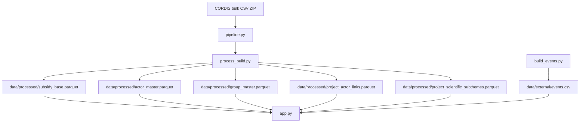

# Subsidy Intelligence Radar

Application Streamlit d'exploration des projets CORDIS (`Horizon Europe` + `Horizon 2020`) avec un modèle de données CORDIS-first, une navigation guidée par question et des vues analytiques orientées métier.

Le projet agrège les données bulk CORDIS, les transforme en un dataset analytique stable, puis les expose dans une app de recherche, de comparaison, de géographie, de tendances et d'analyse d'acteurs.

## Ce qui structure désormais le produit

Le produit n'est plus organisé autour d'une taxonomie métier maison comme axe principal.

Il repose désormais sur 3 niveaux explicites :

1. `cordis_domain_ui`
   - 11 grands domaines CORDIS utilisés pour la navigation, la home guidée et les lectures synthétiques.
2. `cordis_theme_primary`
   - thème principal officiel unique par projet, dérivé prioritairement des métadonnées CORDIS (`programmeDivisionTitle`, `programmeDivision`, `topic`, `call`, `frameworkProgramme`).
3. `scientific_subthemes`
   - sous-thèmes scientifiques multi-label utilisés pour l'exploration fine.

Règle clé :
- les totaux globaux de projets et de budget restent calculés sur le dataset principal et sur `COUNT(DISTINCT projectID)` ;
- les sous-thèmes ne servent pas à recomposer les totaux globaux.

## Ce que l'application permet aujourd'hui

- commencer par une question métier sur une home guidée ;
- cadrer l'analyse par domaine CORDIS, thème principal CORDIS, sous-thèmes scientifiques, pays et période ;
- rechercher des projets et des acteurs ;
- comparer des pays et des acteurs ;
- suivre les tendances et les contextualiser avec une couche macro/événements ;
- ouvrir des vues expertes sans imposer la complexité dès l'entrée.

## Architecture à haut niveau



## Fichiers principaux

- `app.py`
  - application Streamlit, navigation, filtres, vues analytiques, intégration DuckDB.
- `process_build.py`
  - build du dataset principal et des tables analytiques dérivées.
- `pipeline.py`
  - orchestration de refresh, logique incrémentale locale, verrouillage et contrôle de schéma.
- `build_events.py`
  - construction de `events.csv` pour la couche macro/actualités.
- `cordis_taxonomy.py`
  - fonctions de normalisation CORDIS, dérivation du thème principal officiel, domaine UI et sous-thèmes scientifiques.
- `theme_classifier_v3.py`
  - enrichissement déterministe des sous-thèmes scientifiques multi-label.
- `cordis_labels.py`
  - humanisation des labels CORDIS pour l'interface.
- `DOCUMENTATION_TECHNIQUE_COMPLETE.md`
  - documentation technique détaillée.

## Installation locale

### Option 1 — virtualenv

```bash
cd /Users/charlottecrocicchia/Desktop/TotalEnergies/subsidy-intelligence-radar
python3 -m venv .venv
source .venv/bin/activate
python -m pip install --upgrade pip
python -m pip install -r requirements.txt
```

### Option 2 — conda

```bash
cd /Users/charlottecrocicchia/Desktop/TotalEnergies/subsidy-intelligence-radar
conda activate pyshtools_env
python -m pip install -r requirements.txt
```

## Lancer l'application

```bash
cd /Users/charlottecrocicchia/Desktop/TotalEnergies/subsidy-intelligence-radar
streamlit run app.py
```

## Mettre à jour les données

### Recommandé en local : pipeline incrémental

```bash
cd /Users/charlottecrocicchia/Desktop/TotalEnergies/subsidy-intelligence-radar
python pipeline.py
```

Ce mode :
- vérifie les stamps des sources CORDIS ;
- reconstruit le dataset si nécessaire ;
- vérifie aussi le schéma attendu ;
- évite un rebuild complet si rien n'a changé.

### Rebuild complet du dataset analytique

```bash
cd /Users/charlottecrocicchia/Desktop/TotalEnergies/subsidy-intelligence-radar
python process_build.py
```

À utiliser quand :
- la logique de build a changé ;
- la logique de classification CORDIS / sous-thèmes a changé ;
- les fichiers `data/processed/` ont été supprimés ;
- tu veux forcer une reconstruction complète.

### Rebuild de la couche macro / événements

```bash
cd /Users/charlottecrocicchia/Desktop/TotalEnergies/subsidy-intelligence-radar
python build_events.py
```

## Comportement du bouton Refresh dans l'app

En local :
- le bouton **Rafraîchir les données** peut lancer `pipeline.py`, puis `build_events.py`.

Sur Streamlit Community Cloud :
- le bouton de refresh est désactivé volontairement ;
- les mises à jour persistantes doivent passer par GitHub Actions / un rebuild local suivi d'un commit-push des artefacts versionnés.

## Modèle de données actuel

### Dataset principal

Fichier principal :
- `data/processed/subsidy_base.parquet`

Colonnes structurantes :
- `projectID`
- `actor_id`
- `org_name`
- `country_name`
- `amount_eur`
- `project_status`
- `value_chain_stage`
- `cordis_domain_ui`
- `cordis_theme_primary`
- `cordis_theme_primary_source`
- `cordis_topic_primary`
- `cordis_topics_all`
- `cordis_call`
- `cordis_framework_programme`
- `scientific_subthemes`
- `scientific_subthemes_count`
- `legacy_theme`
- `legacy_sub_theme`

### Tables dérivées

`process_build.py` écrit aussi :
- `data/processed/actor_master.{csv,parquet}`
- `data/processed/group_master.{csv,parquet}`
- `data/processed/project_actor_links.{csv,parquet}`
- `data/processed/project_scientific_subthemes.{csv,parquet}`

## Règles de comptage à retenir

- total projets = `COUNT(DISTINCT projectID)` ;
- le thème principal CORDIS est unique par projet ;
- les sous-thèmes scientifiques sont multi-label ;
- un projet peut donc apparaître dans plusieurs sous-thèmes scientifiques ;
- on ne somme jamais les sous-thèmes pour reconstituer le total global ;
- les budgets restent interprétés sur le périmètre filtré courant, au grain principal du dataset, pas sur une explosion naïve des sous-thèmes.

## UX actuelle de l'application

### Home page

La home guidée est organisée autour de :
- une intention utilisateur ;
- des domaines CORDIS ;
- une recherche libre ;
- un périmètre pays ;
- une période.

### Deux modes d'usage

- `Vue d'ensemble`
  - lecture simplifiée, centrée sur la réponse rapide ;
- `Recherche avancée`
  - accès à plus de filtres et aux vues expertes.

### Navigation principale

En pratique, l'app s'organise autour de :
- `⌕ Recherche & résultats`
- `◈ Acteurs`
- `◎ Géographie`
- `↗ Tendances & événements`
- `◇ Outils experts`
- `⋯ Données, méthode & exports`

Les vues synthétiques utilisent par défaut `cordis_domain_ui` comme lecture principale. Les codes CORDIS bruts sont conservés pour les détails, tooltips et exports, pas comme libellés principaux dans les graphes métier.

## Compatibilité et migration

Le repo conserve une compatibilité transitoire avec l'ancien modèle :
- `theme` reste présent comme champ de compatibilité et reflète `cordis_theme_primary` dans la vue analytique ;
- `sub_theme` reste disponible comme compatibilité courte ;
- `legacy_theme` et `legacy_sub_theme` conservent les anciennes valeurs quand elles existent encore.

Le filtre `OneTech only` est désormais un filtre avancé legacy. Il ne structure plus la home, les vues principales ni le modèle produit.

## Déploiement Streamlit Cloud

Pour Streamlit Community Cloud :
- déployer `app.py` comme fichier principal ;
- versionner les artefacts nécessaires dans `data/processed/` et `data/external/` ;
- utiliser GitHub Actions pour les refresh durables.

Points pratiques :
- l'app en cloud lit les artefacts déjà présents ;
- elle ne doit pas dépendre d'un gros rebuild non persistant au runtime ;
- le code affiche la version et l'état des données côté interface pour faciliter les vérifications.

## Dépannage rapide

### L'app n'affiche pas les nouvelles données

Vérifie dans l'ordre :
1. que `process_build.py` ou `pipeline.py` a bien été relancé ;
2. que `data/processed/subsidy_base.parquet` a été réécrit ;
3. que le bon commit a été poussé sur la branche déployée ;
4. que Streamlit Cloud a bien redéployé la dernière version.

### Le refresh est lent

C'est attendu pour un rebuild complet :
- lecture des bulk CORDIS ;
- reconstruction du dataset principal ;
- reconstruction des tables acteurs/groupes ;
- reconstruction de la table multi-label des sous-thèmes.

Si tu veux un workflow plus léger, privilégie `pipeline.py` au lieu de `process_build.py` quand rien de structurel n'a changé.

### Les sous-thèmes scientifiques semblent plus nombreux que les projets

C'est normal :
- le modèle est multi-label ;
- un projet peut être rattaché à plusieurs sous-thèmes scientifiques ;
- ces vues servent à l'exploration fine, pas au total global.

## Documents utiles

- `DOCUMENTATION_TECHNIQUE_COMPLETE.md`
- `AUDIT_QUALITE_CORDIS_RADAR_2026-03-19.md`
- `AUDIT_EXECUTIVE_SUMMARY_CORDIS_RADAR_2026-03-19.md`
- `AUDIT_TECHNIQUE_RISQUES_PREUVES_2026-03-19.md`

## Push GitHub

```bash
git add .
git commit -m "Update documentation for CORDIS-first model"
git push origin <your-branch>
```

